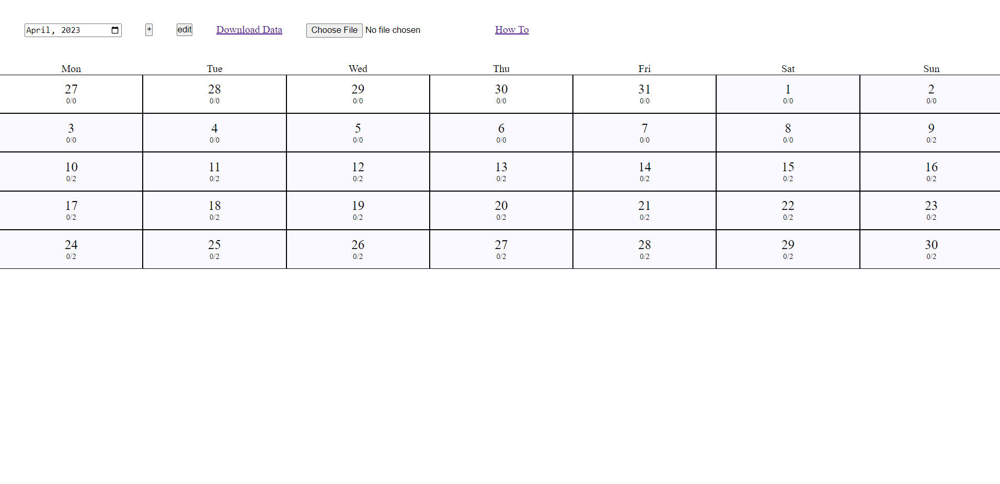
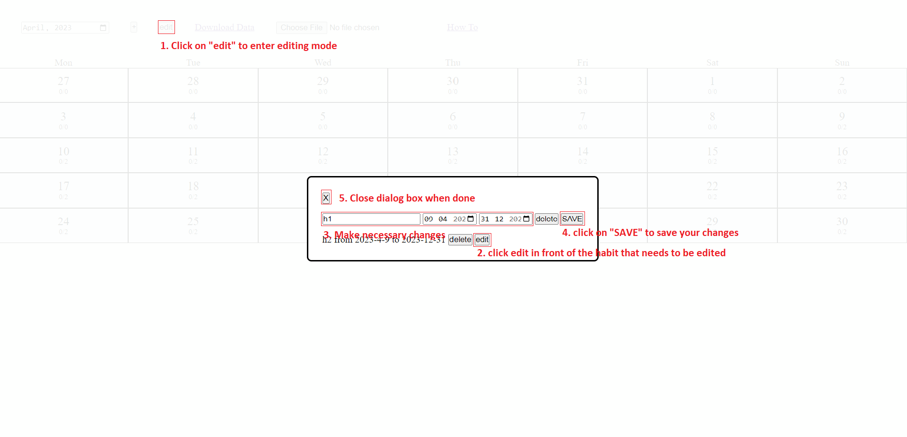
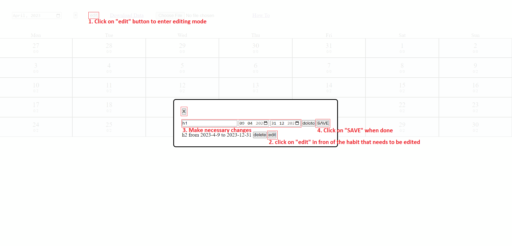
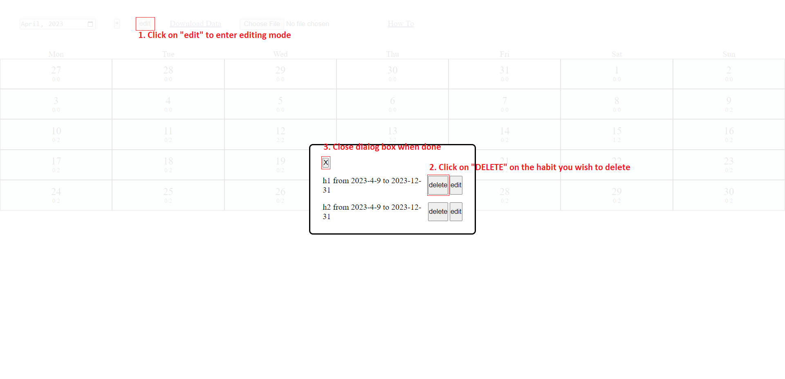
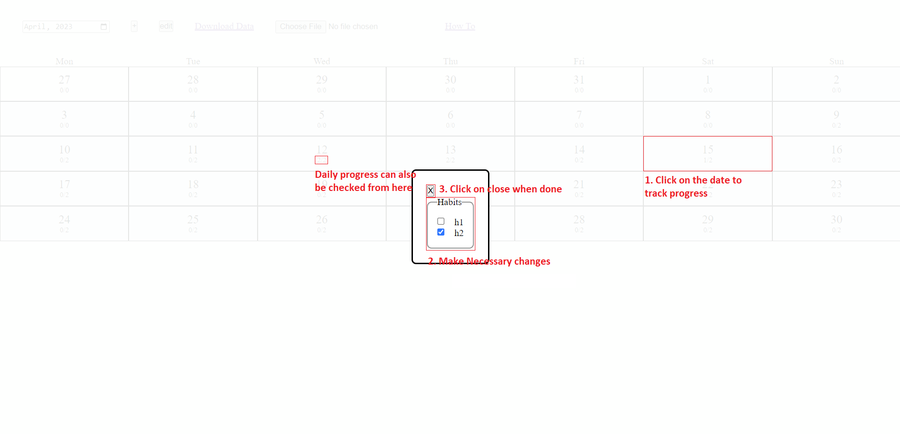
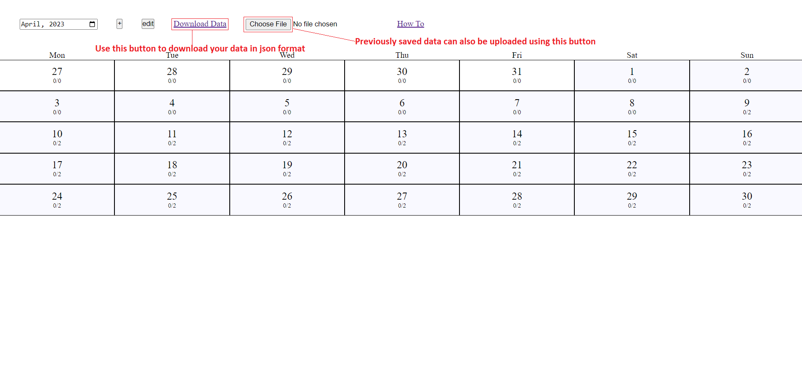

# HABIT TRACKER

Habit Tracker is a simple web app built in JavaScript and webpack.

As the name suggests habit tracker helps the user to keep track of the habits he/she wishes to keep track of.

Usinng this app the user can program the duration (start date and end date) of the habits he/she wishes to pick up. Based on the user input the app can generate a daily to do list for the user to follow.

<br>

# Features

- Add new habits
- Update habits
- Keep track of habits on daily basis
- Preserve your data in `JSON` file
- Upload previously saved data from `JSON` file

<br>

# 📸 Screenshot



<br>

# How To

## Add Habits



## Update Habits



## Delete Habits



## Track Daily Goals



## Save and Upload Files



<br>

# Built with ⚒️

- [Node.js](https://nodejs.org/en/) : Node.js® is an open-source, cross-platform JavaScript runtime environment.

- [Webpack](https://webpack.js.org/): Webpack is a static module bundler for modern JavaScript applications

<br>

# Prerequisites

- [Node.js](https://nodejs.org/en/)
- [Webpack](https://webpack.js.org/)

<br>

# Getting Started

> Habit Tracker is simple web app which use JavaScript and is built with Webpack

## 1. Installing the app

```
npm install
```

## 2. Running the app

```
npm start
```

## 3. Building a local copy

```
npm run build
```
